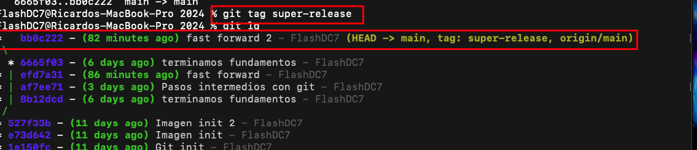
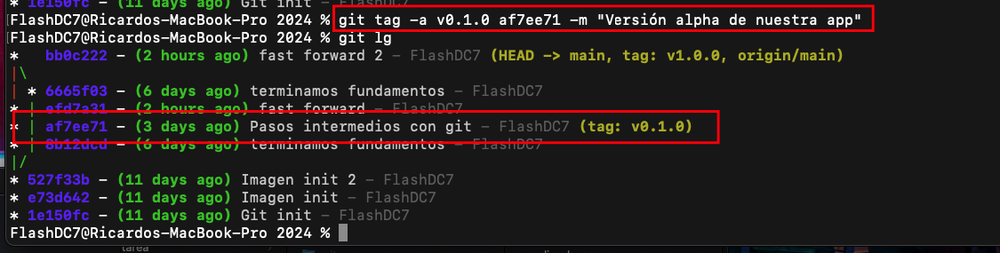

# Git

## Instalacion Git
>1. https://git-scm.com/
>2. Una vez instalado corremos el siguiente comando `git --version`

## Instalaciones Plugins
>1. [Material Icon Theme](https://marketplace.visualstudio.com/items?itemName=PKief.material-icon-theme)

## Ayuda de Git
>- `git --help`
>- Ej. `git --help commit` o `git --help config`
>- Para salir de la ayuda solo presionamos la letra Q

## Configuración de Git localmente

> Cambiar nombre de la rama principal al inicializar un proyecto de master al nombre main
>- `git config --global init.defaultBranch main` 

> Nombre de usuario:
>- `git config --global user.name "FlashDC8"` 

>Email del usuario:
>- `git config --global user.email "ejemplo@mail.com"`

> Listamos nuestras configuraciones locales:
>- `git config --global -e`

> Para salir del modo de edición:
>- Presionamos `ESC`, después escribimos `:q!` y presionamos `ENTER` si no queremos guardar ningún cambio
>- Presionamos `ESC`, después escribimos `:wq!` y presionamos `ENTER` para guardar cambios y salir

>- Presionamos `ESC`, después escribimos `:q!` y presionamos `ENTER` si no queremos guardar ningún cambio
>- Presionamos `ESC`, después escribimos `:wq!` y presionamos `ENTER` para guardar cambios y salir

## Inicializamos Git
>- Abrimos consola y escribimos `cd` y presionamos la tecla de espacio
>- Arrastramos la carpeta de nuestro desarrollo a la terminal para ubicarnos dentro de ella y presionamos `ENTER`
>- Inicializamos git con el siguiente comando `git init` y presionamos `ENTER`
>- Escribimos el comando `git status` y presionamos `ENTER` para ver la rama en la que nos encontramos, los commits y finalmente los archivos traqueados y no traqueados
>- Podemos agregar los archivos a nuestro commit de dos formas
>   - Uno por uno `git add mi_archivo.html`
>   - Todos los arhivos en un solo paso `git add .`
>- Para remover un archivo que no deseamos traquear
>   - Escribimos el comando `git reset nombre_del_archivo.html`y presionamos enter y con esto este archivo ya no es parte del stage antes del commit
>- Realizamos nuestro commit con el comando `git commit -m "nombred_del_commit"` y presionamos enter
>- Listamos nuestro(s) commit(s) con el siguiente comando `git log` 
>   
>- Una forma abreviada de hacer commit es `git commit -am "nombre_del_commit"`, con esta opción solo se guardan en el commit los archivos a los cuales se les esta dando seguimiento y deja fuera los nuevos archivos

>## Restaurar un proyecto a como estaba al último commit
>- `git checkout -- .`

>## Ramas en Git
>- Para saber en que rama nos encontramos actualmente escribimos el comando `git branch` y presionamos enter
>- Es recomendable trabajar en diferentes ramas todas y solo la principal usarla para los cambios que se van a producción
>- Renombrar una rama. Ej del nombre ***master*** a ***main***, escribimos el comando `git branch -m master main` y presionamos enter

 

 >## Agregar archivos de un solo tipo o directorio
 >- Archivos html en raíz `git add *.html`
 >- Agrega los archivos js de la carpeta `git add js/*.js`
 >- Toma todos los archivos y directorios que se encuentra en este path `git add css/`

 >## Seguimiento a carpetas
 >- ** Git no da seguimiento a carpetas que se encuentran totalmente vacias
 >- Para mantener un directorio vacio en nuestro repositorio que sabemos que necesitamos en nuestro proyecto solo agregamos dentro del directorio el siguiente archivo **.gitkeep**
>   
>  

>## Creación de ALIAS para nuestros comandos
>- Son versiones cortas de los comandos de git, para crear un alias escribimos el siguiente comando `git config --global alias.nombre_del_alias seguido de los comandos que deseamos agregar entre comillas`
>- Ej `git config --global alias.lg "log --graph --abbrev-commit --decorate --format=format:'%C(bold blue)%h%C(reset) - %C(bold green)(%ar)%C(reset) %C(white)%s%C(reset) %C(dim white)- %an%C(reset)%C(bold yellow)%d%C(reset)' --all"` 
>- Para modificar un alias tecleamos el siguiente código `git config --global -e`
>     
>- Una vez que terminamos la edición presionamos ESC después :wq!

>## Ver las modificaciones 
>- Para ver los ajustes que realizamos antes de añadirlos al stage insertamos el siguiente código en consola `git diff` y presionamos ENTER
>- Para ver los ajustes que realizamos después de añadirlos al stage insertamos el siguiente código en consola `git diff --staged` y presionamos ENTER

>## Actualizar mensaje del commit y revertir commit
>- Para actualizar el nombre del último commit ingresamos el siguiente código `git commit --amend -m "nuevo_nombre_del_commit"` y presionamos ENTER
>- Si queremos ingresar a modo edición desde terminal entonces escribimos `git commit --amend` y presionamos ENTER
>- Una vez que ingresamos presionamos la tecla A y nos movemos con las flechas direccionales. Ya terminada la edición presionamos ESC después escribimos `:wq!`
>- Para revertir un commit ingresamos el siguiente comando `git reset --soft HEAD^` y presionamos ENTER. Con esto lo que hacemos es eliminar el último commit sin perder los cambios que se habian realizado en los archivos
>- Igual podemos cambiar por el HEAD por el hash de commit que deseamos revertir `git reset --soft 527f33b` o colocando el numero de commits antes del último `git reset --soft HEAD^2` 
>- Cuando hacemos el reset a un punto de la historia perdemos de vista todos los commits posteriores, para visualizar nuevamente estos commits ingresamos `git reflog` y presionamos ENTER
>    
>  *&nbsp;El caracter ^ se obtiene en configuración de teclado ingles con SHIFT + 6 y presionamos la tecla de espacio 
>  ** `git reset --soft` conserva los cambios 
>  *** `git reset --mixed` regresa en el tiempo, mantiene los cambios y saca los archivos del stage 
>  **** `git reset --hard` regresa en el tiempo y elimina los cambios 

>## Mover archivos con git, renombrar y eliminar
>- Para mover un archivo de un path a otro con git introducimos el siguiente comando `git mv nombre_archivo.html htmls/nombre_archivo.html` y presionamos ENTER
>- Al igual si deseamos renombrar el archivo al mismo tiempo introducimos el siguiente comando `git mv nombre_archivo.html htmls/nuevo_nombre_archivo.html` y presionamos ENTER
>- Al igual si deseamos renombrar el archivo y dejarlo en el mismo path con el siguiente comando `git mv nombre_archivo.html nuevo_nombre_archivo.html` y presionamos ENTER
>- Para eliminar un archivo con git introducimos el siguiente comando `git rm nombre_archivo.html` y presionamos ENTER
>  * Con estas acciones se agrega al stage dicho archivo para que nosotros creemos un nuevo commit

## Git ignore
>- Cuando no queremos darle seguimiento a una carpeta o archivo generamos un archivo llamado **.gitignore** en la raíz del proyecto, el lugar donde se encuentra nuestro archivo **.git**
>   
> 
>- En dicho archivo ingresamos los nombres de todos los archivos y carpetas que deseamos ignorar en git
>  

## Ramas, uniones y conflictos
>- Crear una rama en git introducimos el siguiente comando `git branch nombre_de_la_rama` y presionamos ENTER
>- Ver todas nuestras ramas, incluida la que acabamos de crear `git branch` y presionamos ENTER
>- Movernos a una rama `git checkout nombre_de_la_rama` y presionamos ENTER
>- Crear una rama y movernos al mismo tiempo `git checkout -b nombre_de_la_rama` y presionamos ENTER
>- Unir una rama a otra `git checkout nombre_de_la_rama_a_la_que_queremos_unir` y presionamos ENTER
>- Después `git merge nombre_de_la_rama_que_queremos_unir` y presionamos ENTER
>- Al unir ramas desde consola puede que nos arroje el mensaje de Merge branch, si es así debemos ingresar el nombre de un nuevo commit para que git nos guarde los cambios de esta unión. Después presionamos `ESC :wq!` y presionamos ENTER 
>- Eliminar una rama `git branch -d nombre_de_la_rama_que_queremos_eliminar` y presionamos ENTER
>- Eliminar una rama de manera forzada `git branch -d nombre_de_la_rama_que_queremos_eliminar -f` y presionamos ENTER
>   *&nbsp;Se recomienda trabajar en ramas nuevas funcionalidades de nuestros desarrollos
>  ** Al igual una vez que hacemos merge de una rama que sabemos que ya no sufrira más cambios se recomienda eliminarla

> ## Tags o etiquetas
>- Los tags o etiquetas no son más que referencias a un commit en especifico
>- Los tags son utilizados para marcar versiones o releases de nuestros desarrollos
>   
> 
>- Enlistar todos los tags `git tag` y presionamos ENTER
>- Eliminar un tag `git tag -d nombre_del_tag` y presionamos ENTER
>- Crear una versión anotada `git tag -a v1.0.0 -m "Versión 1.0.0 lista"
>- Agregar tags a commits anteriores `git tag -a v0.1.0 hash_del_commit -m "nombre de la etiqueta"`
>   
> 
>- Para ver más información de un tag en especifico `git show nombre_del_tag`
>   
> 
>- *&nbsp;Versión 1.0.0 1(cambios importantes).0(agragamos una nueva funcionalidad).0(corrección de errores)

